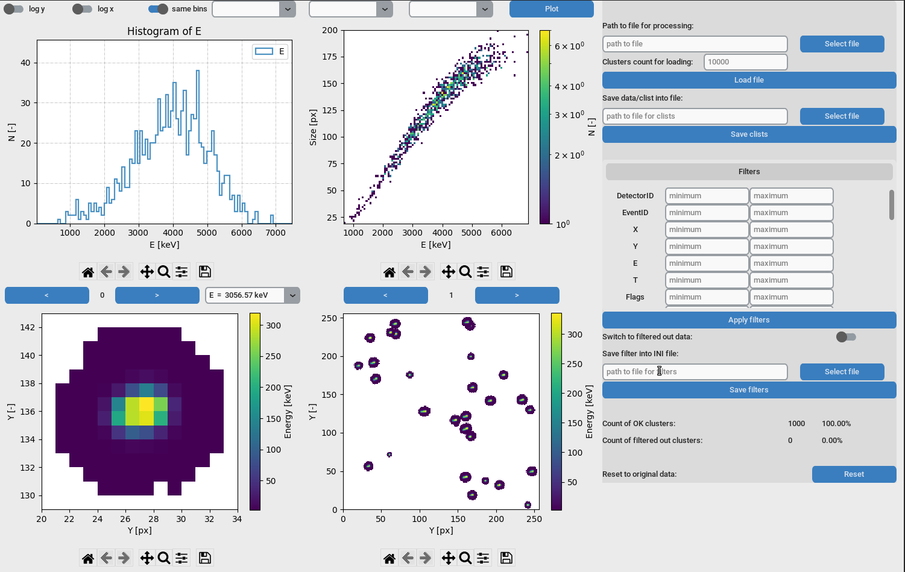

Cluster Visualizer
===============================================================
Version:            1.2
Date:               15/10/2023  
Author:             Lukas Marek (lukas.marek@advacam.cz)  

-------------------------------------------------------------------------------
Introduction
-------------------------------------------------------------------------------

Tool for cluster visualisation and data filtering based on the cluster features. 
Input data has to be in format of clist (can be produced with newest dpe).

-------------------------------------------------------------------------------